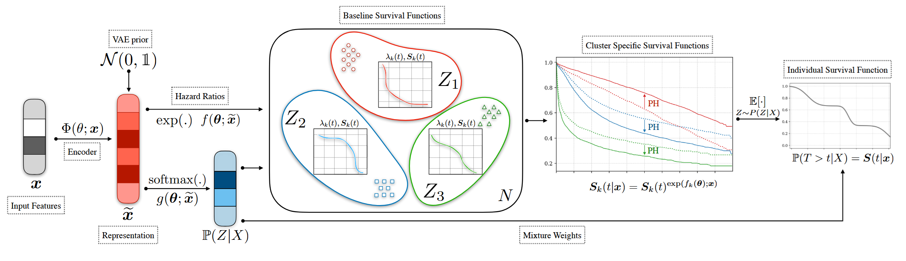
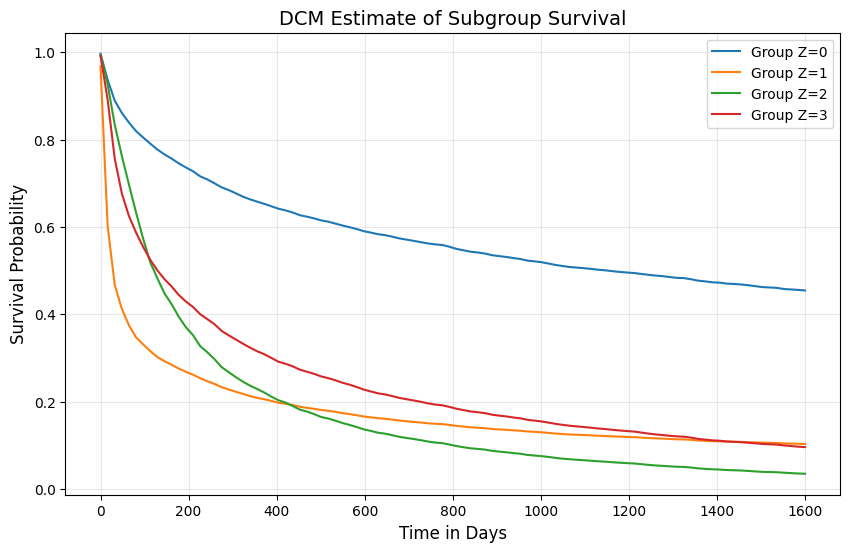
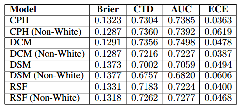
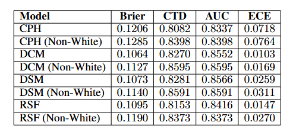
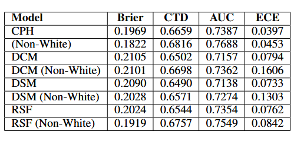
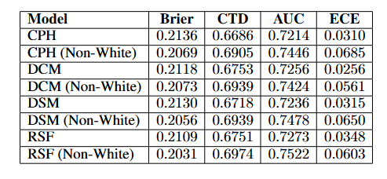
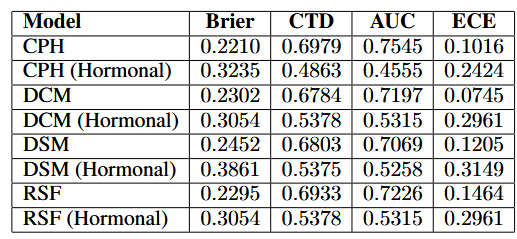

# Deep Cox Mixtures for Survival Regression - Reproduction Study  
*(CS598: Deep Learning for Healthcare @ UIUC)*  

[](https://colab.research.google.com/github/chrisyu-uiuc/revisit-deepcoxmixtures-cs598-uiuc/)
[](https://opensource.org/licenses/MIT)

This repository contains our reproduction study of the paper ​**​[Deep Cox Mixtures for Survival Regression](https://arxiv.org/abs/2101.06536)​**​ by Nagpal et al. (2021), including our full analysis paper: [Revisit_DeepCoxMixturesForSurvivalRegression.pdf](Revisit_DeepCoxMixturesForSurvivalRegression.pdf).



[](https://youtu.be/2aOiDXZQEUY)

[Project Presentation Video (Actual Presentation) ](https://www.youtube.com/watch?v=2aOiDXZQEUY).
[Project Presentation Video (AI Voice Over) ](https://www.youtube.com/watch?v=3dN7VIKomVY).


## Table of Contents
- [Project Overview](#project-overview)
- [Key Features](#key-features)
- [Datasets](#datasets)
- [Notebooks](#notebooks)
- [Results](#results)
- [Dataset Analysis](#dataset-analysis)
- [Contributors](#contributors)
- [License](#license)
- [Acknowledgments](#acknowledgments)

## Project Overview
Survival analysis predicts the probability of an event occurring within a specific time period, with applications ranging from medical prognosis to industrial reliability. This project focuses on reproducing and evaluating the Deep Cox Mixtures (DCM) model, which addresses limitations of traditional survival analysis methods like the Cox Proportional Hazards model.

## Key Features

### Implementation Highlights
- Press-to-run Colab Notebooks for easy reproduction
- Additional GBSG dataset for verification
- Comprehensive dataset exploration and visualization
- Multiple evaluation metrics comparison

### Evaluation Metrics
| Metric | Description | Ideal Value |
|--------|------------|------------|
| C-index | Ranking accuracy | Closer to 1.0 |
| Brier Score | Prediction calibration | Closer to 0.0 |
| ECE | Calibration error | Closer to 0.0 |
| AUC | Discrimination | Closer to 1.0 |

## Datasets

### SUPPORT Dataset
- ​**Source**: Study to Understand Prognoses Preferences Outcomes and Risks of Treatment
- ​**Size**: 9,105 critically ill patients
- ​**Features**: 25 clinical/demographic variables
- ​**Task**: Predict 180-day survival probability
- ​**Access**: [Kaggle](https://www.kaggle.com/datasets/joebeachcapital/support2)

### SEER Dataset
- ​**Source**: National Cancer Institute's registry
- ​**Size**: ~400,000 breast cancer cases (subset used)
- ​**Features**: Tumor characteristics, treatment, demographics
- ​**Task**: Predict cancer-specific survival
- ​**Access**: [Kaggle](https://www.kaggle.com/datasets/sujithmandala/seer-breast-cancer-data)

### GBSG Dataset
- ​**Source**: German Breast Cancer Study Group
- ​**Size**: 686 patients with node-positive breast cancer
- ​**Features**: Tumor characteristics and treatment data
- ​**Task**: Predict recurrence-free survival
- ​**Access**: [Kaggle](https://www.kaggle.com/datasets/utkarshx27/breast-cancer-dataset-used-royston-and-altman)

## Notebooks

| Notebook | Description | Colab |
|----------|-------------|-------|
| [SEER Analysis](598DL4H_DCM_CV_Example_Code_SEER.ipynb) | Cancer survival modeling | [](https://colab.research.google.com/github/chrisyu-uiuc/revisit-deepcoxmixtures-cs598-uiuc/blob/main/598DL4H_DCM_CV_Example_Code_SEER.ipynb) |
| [SUPPORT Analysis](598DL4H_DCM_CV_Example_Code_SUPPORT.ipynb) | ICU patient survival | [](https://colab.research.google.com/github/chrisyu-uiuc/revisit-deepcoxmixtures-cs598-uiuc/blob/main/598DL4H_DCM_CV_Example_Code_SUPPORT.ipynb) |
| [GBSG Analysis](598DL4H_DCM_CV_Example_Code_GBSG.ipynb) | Breast cancer survival | [](https://colab.research.google.com/github/chrisyu-uiuc/revisit-deepcoxmixtures-cs598-uiuc/blob/main/598DL4H_DCM_CV_Example_Code_GBSG.ipynb) |

# Installation & Quick Start

## 🛠️ Local Setup

### Prerequisites
- Python 3.8+
- pip package manager
- Git (optional)

### 1. Clone Repository
```bash
git clone https://github.com/chrisyu-uiuc/revisit-deepcoxmixtures-cs598-uiuc.git
cd revisit-deepcoxmixtures-cs598-uiuc
```

### 2. Install Dependencies
```bash
pip install -r requirements.txt
pip install notebook  # Only if not already installed
```

### 3. Run SEER Breast Cancer Analysis
```bash
jupyter notebook 598DL4H_DCM_CV_Example_Code_SEER.ipynb
```

## Results

### Prediction of Survival Curve using DCM (Support Dataset)


### Performance Comparison

​**SEER Dataset Results (75th Percentile)​**​



​**SEER Dataset Original Results (75th Percentile) from the paper​**​



​**SUPPORT Dataset Results (75th Percentile)​**​



​**SUPPORT Dataset Original Results (75th Percentile)​**​



​**GBSG Dataset Results (75th Percentile)​**​



## Dataset Analysis
| Notebook | Description | Colab |
|----------|-------------|-------|
| [SEER Analysis](598DL4H_DCM_CV_Example_Code_SEER_Analysis.ipynb) | Feature analysis | [](https://colab.research.google.com/github/chrisyu-uiuc/revisit-deepcoxmixtures-cs598-uiuc/blob/main/598DL4H_DCM_CV_Example_Code_SEER_Analysis.ipynb) |
| [SUPPORT Analysis](598DL4H_DCM_CV_Example_Code_SUPPORT_Analysis.ipynb) | Data exploration | [](https://colab.research.google.com/github/chrisyu-uiuc/revisit-deepcoxmixtures-cs598-uiuc/blob/main/598DL4H_DCM_CV_Example_Code_SUPPORT_Analysis.ipynb) |

## Contributors
- ​**Chris Yu**​ ([hmyu2@illinois.edu](mailto:hmyu2@illinois.edu))
- ​**Jimmy Lee**​ ([jl279@illinois.edu](mailto:jl279@illinois.edu))

## License
MIT License - See [LICENSE](LICENSE) for details.

## Acknowledgments
- Original DCM authors: Chirag Nagpal et al.
- Course: [CS598: Deep Learning for Healthcare](https://sunlab.org/) @ UIUC
- Dataset providers: SUPPORT Study Group, NCI SEER Program, GBSG